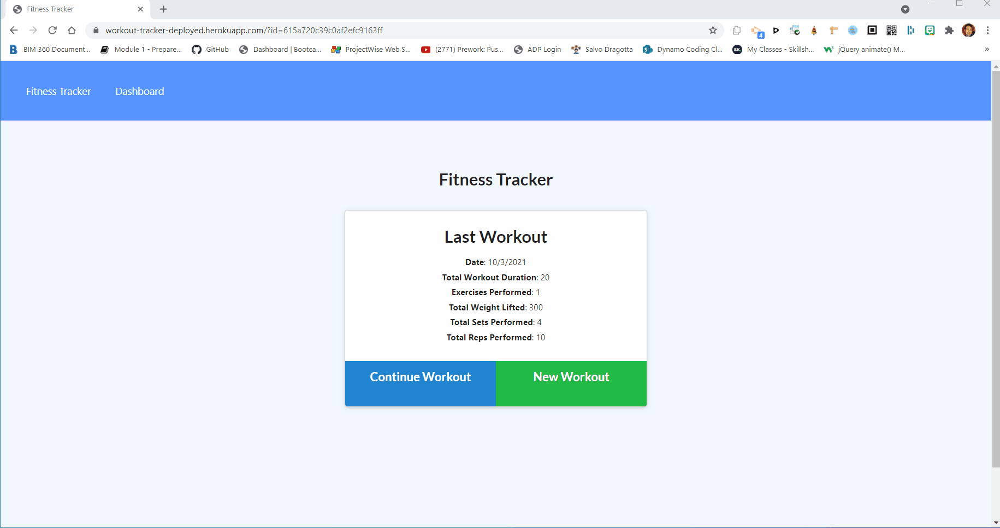

# Workout Tracker


[](https://opensource.org/licenses/MIT)

<details>
<summary><h2>Table of Contents</h2></summary>

- [Description](#description)
- [Installation](#installation)
- [Usage](#usage)
- [License](#license)
- [Contributing](#contributing)
- [Follow](#follow)
</details>

----

## Description

By using this Workout Tracker, you are able to view create and track daily workouts. You are able to log multiple exercises in a workout on a given day. You  also able to track the name, type, weight, sets, reps, and duration of exercise. If the exercise is a cardio exercise, you are able to track your distance traveled. 

The App uses a [Mongo database](https://www.mongodb.com/) with a [Mongoose schema](https://mongoosejs.com/) and handle routes with [Express](https://expressjs.com/). The App has been deployed to [Heroku](https://www.heroku.com/) using a [MongoDB Atlas](https://www.mongodb.com/cloud/atlas)

The following animation shows the web application's appearance and functionality:



You can view the deployed App at this link. [Workout Tracker deployed](https://workout-tracker-deployed.herokuapp.com)

----

## Installation

💾    

- This application need node.js, please refer to the [Official website](https://nodejs.org/en/download/) for installation
- This application also need to install mongodb, please refer to [mongodb](https://coding-boot-camp.github.io/full-stack/mongodb/how-to-install-mongodb) for installation
- Install required node packages by running the following at the root of your project

    ```bash
    npm install
    ```
- Add sample data to the database by running the following at the root of your project  

    ```bash
    node seeders/seed
    ``` 

----

## Usage

💻   
  
Run the following command at the root of your project to start the application’s server

```bash
npm start
```

----

## License

This App is covered by the \


----

## Contributing

Fork this repository if you want to contribute\
[](https://github.com/MM-SalvoDragotta/workout-tracker/fork)

----

## Follow
[](https://twitter.com/Dynamo_Sydney)\
[](https://github.com/MM-SalvoDragotta/)
